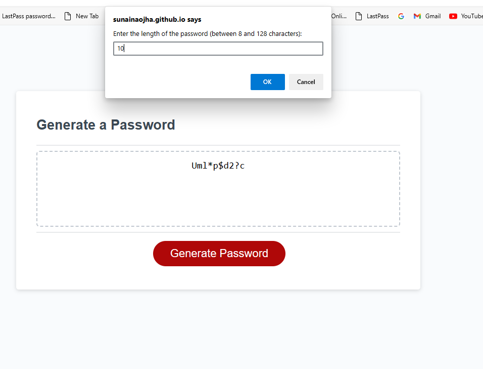
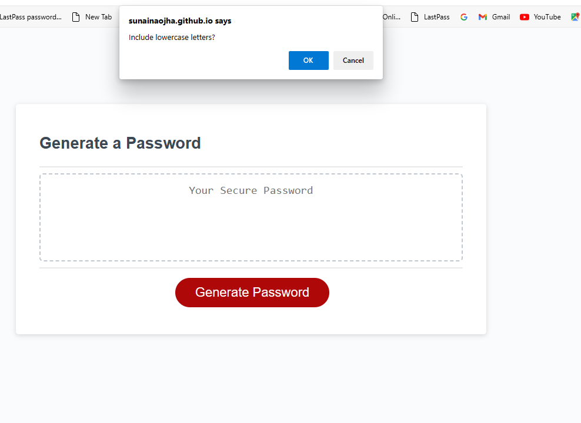
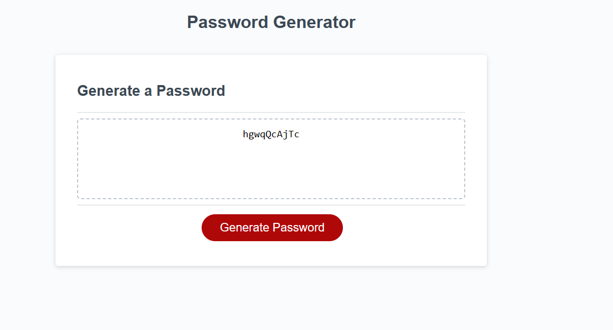

# Password-Generator

## Description
We were given a starter code and i have added some code for the password generation. The prompt will ask if i need uppercase, lowercase but there must be atlest one special character. And the length of a password should be between 8 to 128 characters. 

## Technologies
* HTML
* CSS

## Links 

[live UrL](https://sunainaojha.github.io/Password-Generator/)\
[Github](https://github.com/sunainaojha/Password-Generator)

## Screenshots

